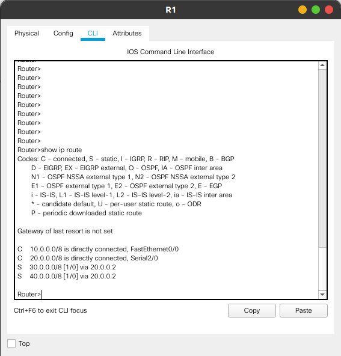
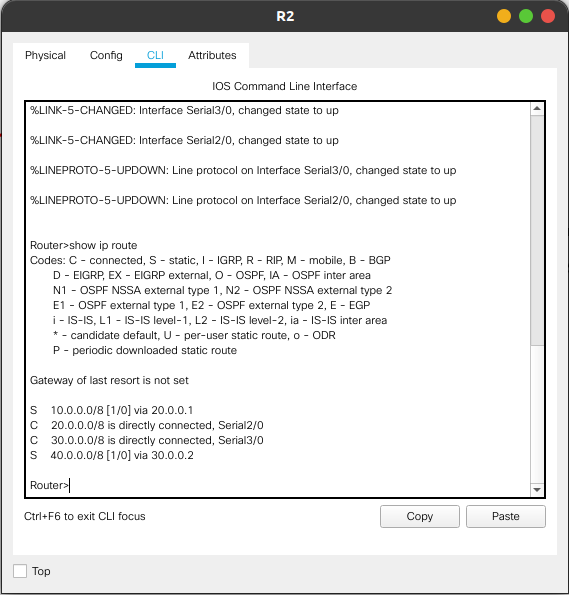
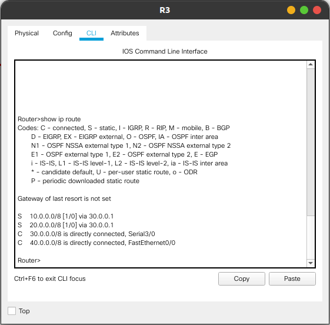
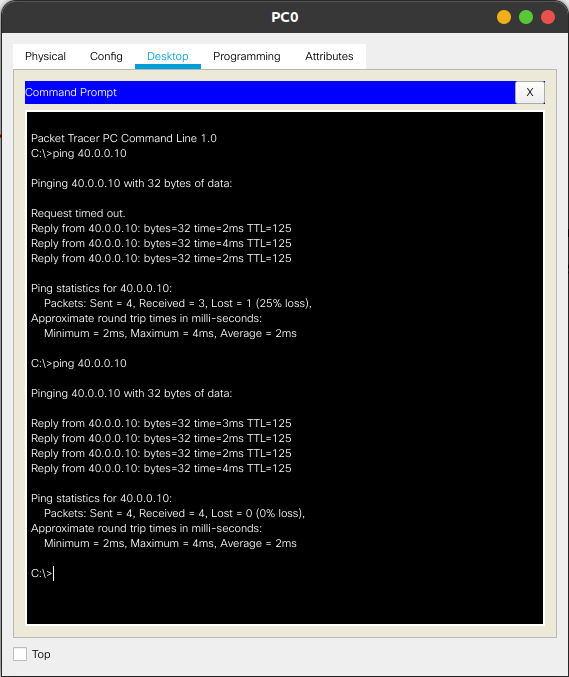
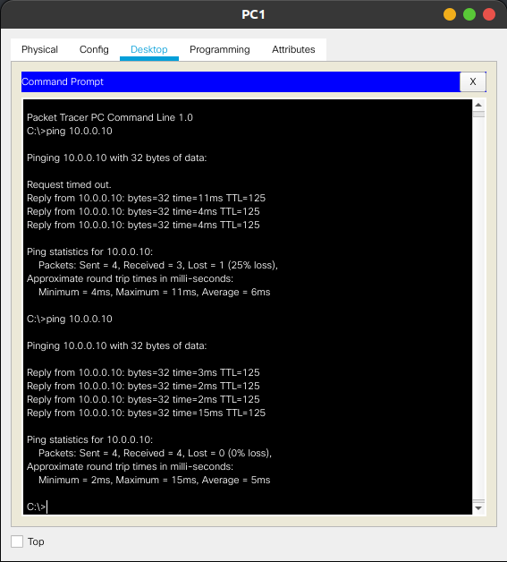

<h4>Harshit Hiremath</h4>
<h4>1BM18CS036</h4>
<h4>A2 Batch</h4>

<h1> Configuring Static Routes in Multiple Router Topology </h1>

## Observations

1. Creating a multiple router topology by connecting routers on Serial ports and PC-router through Fast Ethernet ports.
2. Assigning IP addresses and gateway to routers as shown in topology below.
3. Pinging PC1 from PC0 at this state gives `destination host unreachable`
4. Adding static routes to the routers using `ip route <dest. network> <subnet mask> <next hop>` in _configure teminal_ mode.
5. Pinging PC1 from PC0 and PC0 from PC1 now works as expected (shown in images below).

---

## Topology

## 

---

## Router R1 Static IP routes

## 

---

## Router R2 Static IP routes

---

## Router R3 Static IP routes

---

## PC0 pinging PC1

---

## PC1 pinging PC0

