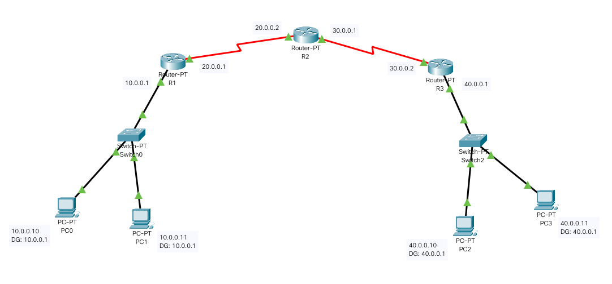
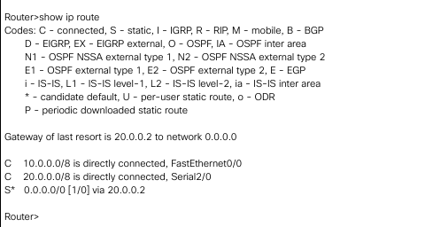
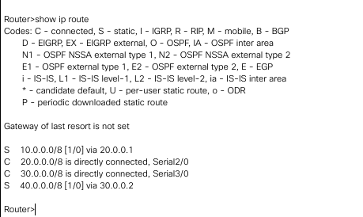
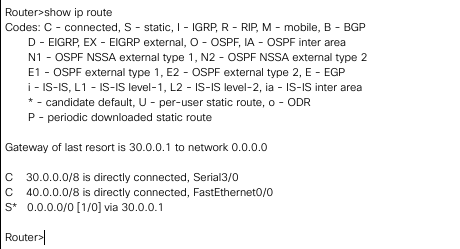
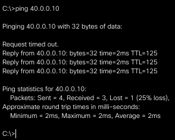
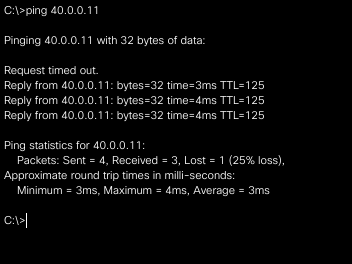

<h1>Configuring default route to the Router</h1><h3>Lab 4 (12 October 2020)</h3>

## Procedure

1. A toplogy was created using three PT Routers, two Switch-PTs and two PC's connected to each switch
2. Default gateways and unique ip addresses were configured for each PC and router.
3. Static routes were configured from routers R1, R2, and R3
4. Pinging PC2 from PC0 gave, which are on networks 10.0.0.0 and 40.0.0.0 respectively, gave sucessful ping responses. Similarly, PC3 was pinged from PC1
5. ip routes for each router was viewed using the command: show ip route
6. Static ip route was configured for router 1 using CLI commands: ip route destination_network subnet_mask next_hop_address
7. Default ip route was configured for router 0 and router 2 using CLI commands: ip 0.0.0.0 0.0.0.0 next_hop_address

## Screenshots

### Topology

### Router R1 default route

### Router R2 static routes

### Router R3 default route

### Ping test PC2 from PC0

### Ping test PC3 from PC1

