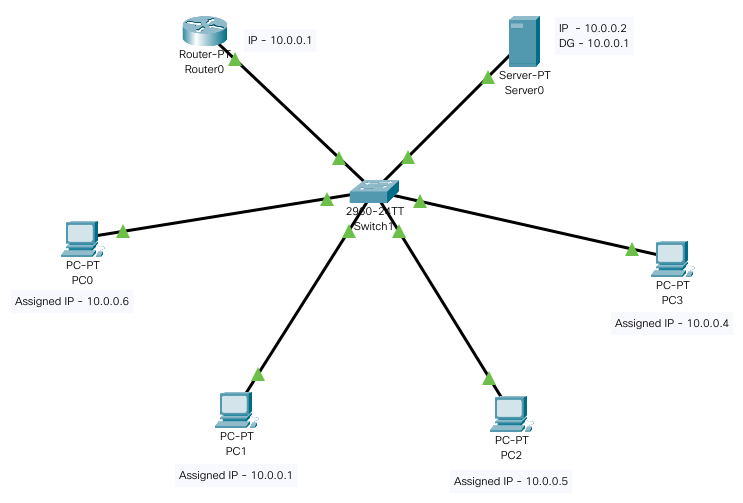
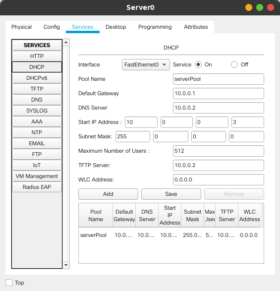
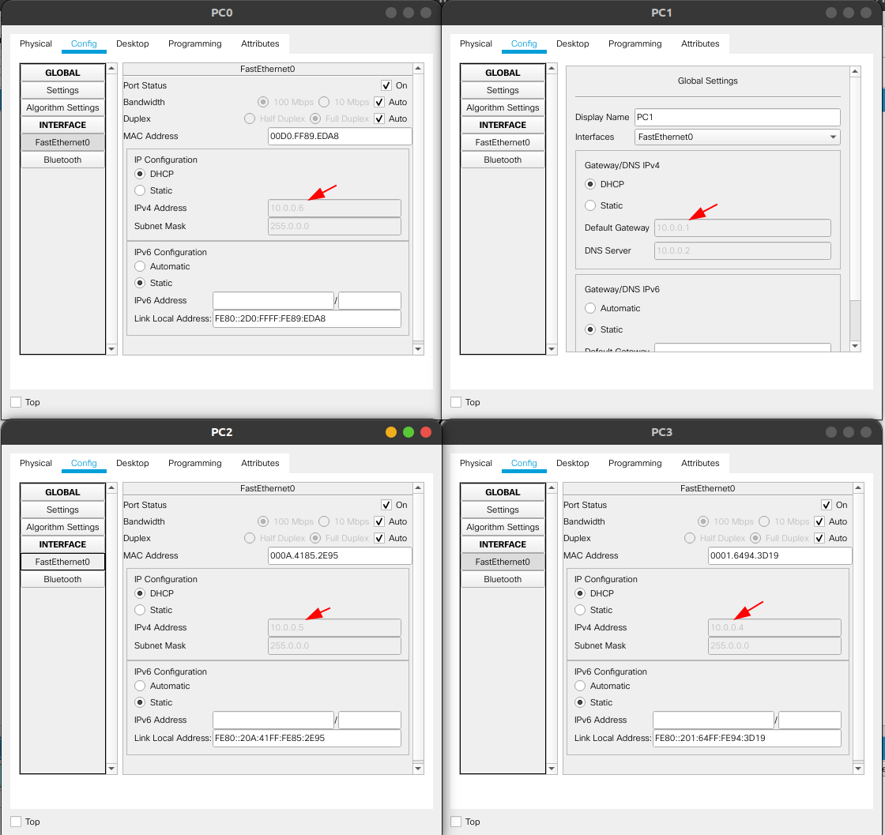
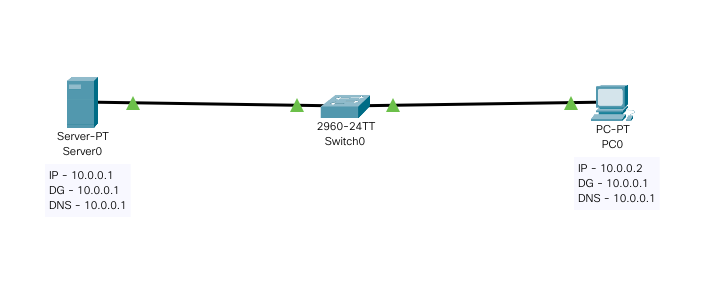
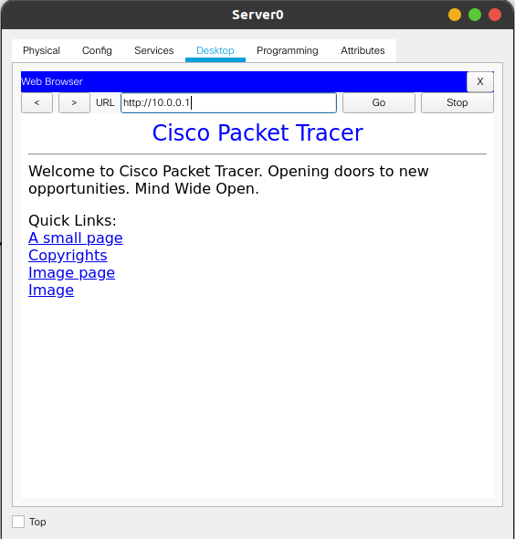
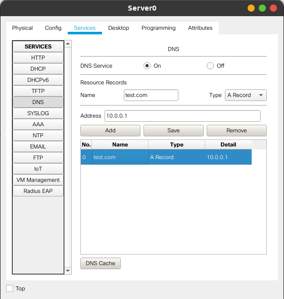
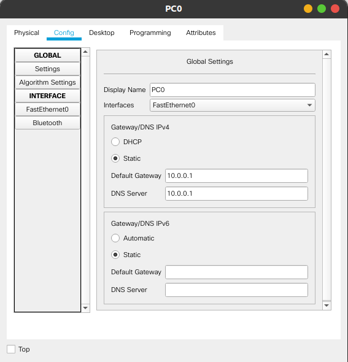
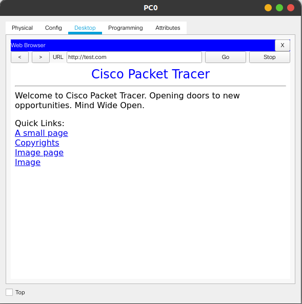

 <h1>Lab 5 - 02 November 2020</h1>

# Configuring DHCP within a LAN

## Procedure

-   Topology, as shown in image, was created using Router-PT, 2960 Switch, Server-PT, and 4 PCs.

-   IP addresses were assigned to Router and the server as shown in image below.

    

-   DHCP service in the Server0 was enabled with the following configs.

    

-   DHCP server in the Server0 automatically assigns the IP addresses to PC0, PC1, PC2, PC3 on enabling the DHCP service.

    

---

# Demonstration of WEB server and DNS

Initialize HTTP server in the Server0.  
Add a record in the DNS to route _`test.com`_ to _`10.0.0.1`_.

## Procedure

-   Topology, as shown in the image below, was created using Server-PT, 2960 Switch, and a PC.

    

-   It was first verified that 10.0.0.1 has a HTTP server running.

    

-   Then, an address entry was added for _`test.com`_ in the DNS records as shown below.

    

-   PC0 was setup with the following configs.

    

-   The DNS server is tested by going to _`test.com`_ URL from PC0

    
