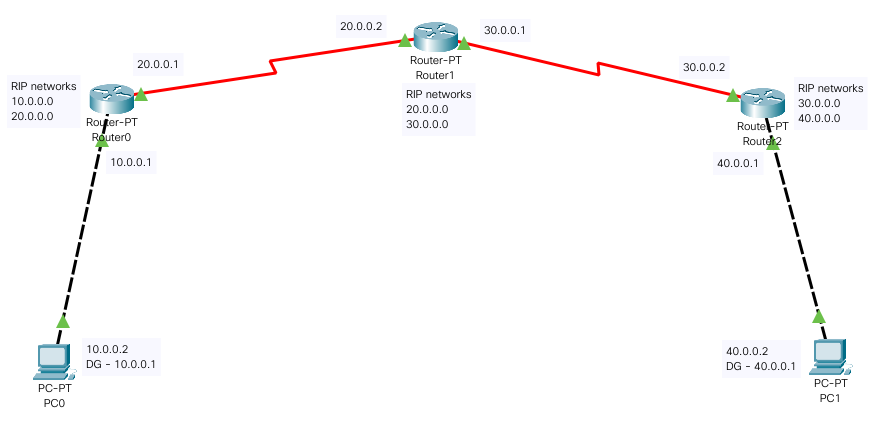
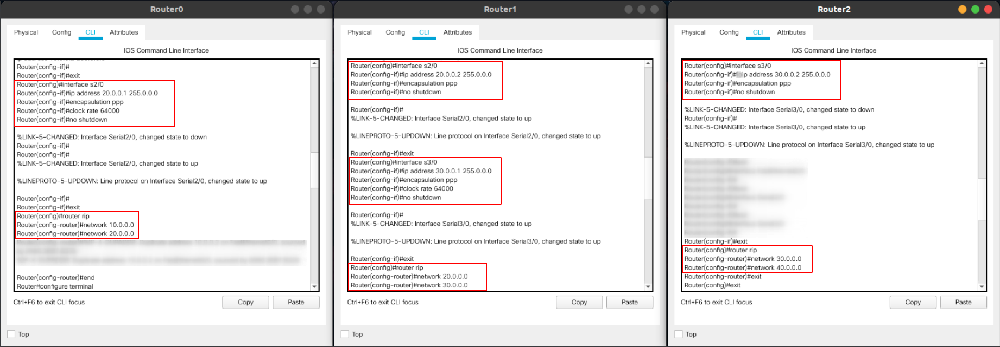
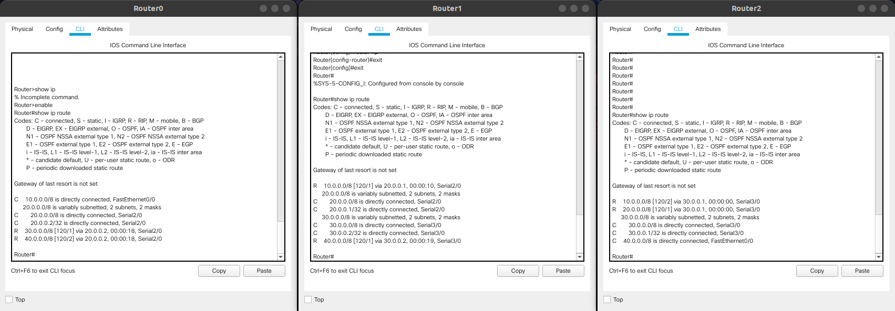
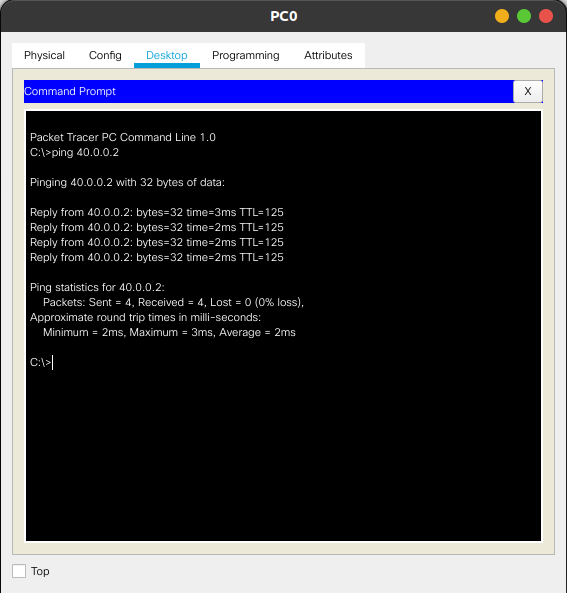
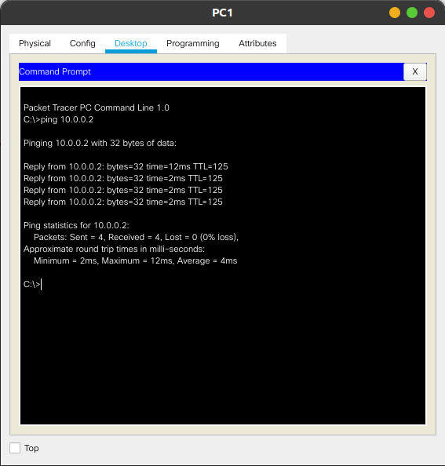

 <h1> Class / Lab session on RIP routing </h1>
 <h4>06 November 2020</h4>

# Configuring RIP Routing Protocol in Routers

## Procedure

-   Topology, as shown in image, was created using 3 Router-PTs, and 2 PCs.

-   IP addresses were assigned to Router and the PC as shown in topology.

    

-   Network addresses were added with suitable clock rates to the RIP routing table, as shown below.

    

## Testing

-   Verifying the routes using _`show ip`_ command.

    

-   Finally, PC0 and PC1 were pinged to each other to test

    

    
